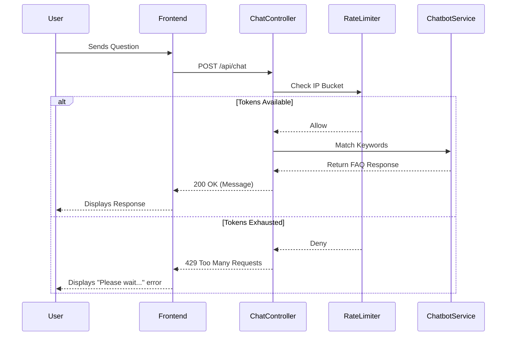

# 🤖 AI Chatbot & 🛡️ Rate Limiting Documentation

Welcome to the documentation for the AI Chatbot and Rate Limiting features in Lather & Line! This guide will walk you through what these features do, the problems they solve, and how they're built under the hood. 🚀

## 🌟 What the feature does

The AI Chatbot provides users with a floating chat bubble on the frontend that expands into a toggleable panel. It offers a friendly interface to answer common user queries immediately. 

Key user-facing features include:
- **Welcome Message**: Greets the user automatically upon opening the chat.
- **Suggested Quick Questions**: Helpful prompt buttons for frequently asked questions.
- **Typing Indicator**: Gives a natural, conversational feel while the "bot" is processing the response.
- **Auto-scroll**: Keeps the newest messages in view seamlessly.

Behind the scenes, the chatbot uses a rule-based keyword matching system (with 9 pre-configured FAQ entries covering schedule, pickup, pricing, etc.) to respond to queries. 

To protect the server from spam or abuse, the chat API is safeguarded by a **Rate Limiter**, enforcing a strict policy: a maximum of **5 requests per 60 seconds per IP address**.

## 🛠️ What problem it solves

1. **Instant Customer Support**: Customers often have the same basic questions (e.g., "What are your prices?", "When do you schedule pickups?"). The chatbot provides immediate answers 24/7 without requiring human intervention, reducing the support burden.
2. **API Abuse Prevention**: A publicly accessible chat API is a prime target for spam bots or malicious actors who could overload the server. Rate limiting prevents Denial of Service (DoS) and ensures fair usage for legitimate users.
3. **Future-Proofing**: While currently using rule-based keyword matching, the architecture includes placeholders to easily swap in a real Large Language Model (like Gemini or OpenAI) as the business grows.

## 🏗️ How it's implemented

### 1. The Chatbot Backend
The backend currently operates on a lightweight, rule-based keyword matching engine. We've defined 9 standard FAQ entries. When a user sends a message, the system scans the text for specific keywords and returns the corresponding pre-defined answer. A placeholder service is already in place to integrate an actual LLM API call in the future!

### 2. Rate Limiting with Bucket4j
We use the **Bucket4j** library, which implements the Token Bucket algorithm. 
- **Storage**: We maintain an in-memory `ConcurrentHashMap` mapping each incoming IP address to a specific `Bucket`.
- **Lazy Initialization**: A bucket is only created the first time an IP address makes a request, conserving memory.
- **Policy**: The token bucket is configured to hold 5 tokens, refilling at a rate that allows 5 requests every 60 seconds.
- **Enforcement**: This logic is applied directly via an interceptor or within the `ChatController` to reject requests (`429 Too Many Requests`) when a bucket is empty.

### 3. Frontend Component
The UI is designed to be non-intrusive yet accessible. The floating chat bubble acts as a toggle for the main panel. State management handles the chat history, the visibility of the typing indicator, and automatically scrolling the chat window to the bottom when a new message is added.

## 🧠 What was learned from building it

- **Token Bucket Algorithm**: Gained a practical understanding of how token buckets effectively manage bursty traffic while enforcing an overall rate limit. Bucket4j proved to be an excellent, lightweight choice for this pattern.
- **Concurrent Maps for State**: Utilizing `ConcurrentHashMap` is crucial for thread-safe, in-memory state management when dealing with multiple simultaneous web requests and rate limiting.
- **UI/UX Polish Matters**: Small details like a typing indicator and auto-scrolling are vital for a chat interface. Without them, the application feels mechanical and significantly less user-friendly.
- **Designing for Replaceability**: Building a rule-based bot behind a clear interface makes it trivial to swap the implementation for a sophisticated LLM later without altering the controller or frontend code.

## 📁 Key files involved

Here are the primary files powering these features:

- [ChatController.java](file:///c:/games/java%20code/Lether-line/src/main/java/com/latherline/controller/ChatController.java) - Handles incoming chat requests and integrates rate limiting logic.
- [ChatService.java](file:///c:/games/java%20code/Lether-line/src/main/java/com/latherline/service/ChatService.java) - Contains the rule-based keyword matching logic, the 9 FAQ entries, and LLM placeholders.
- [RateLimitingService.java](file:///c:/games/java%20code/Lether-line/src/main/java/com/latherline/service/RateLimitingService.java) - Manages the Bucket4j `ConcurrentHashMap` and IP tracking.
- [ChatBubble.jsx](file:///c:/games/java%20code/Lether-line/frontend/src/components/ChatBubble.jsx) - The React component for the floating UI, toggleable panel, typing indicators, and message history.
