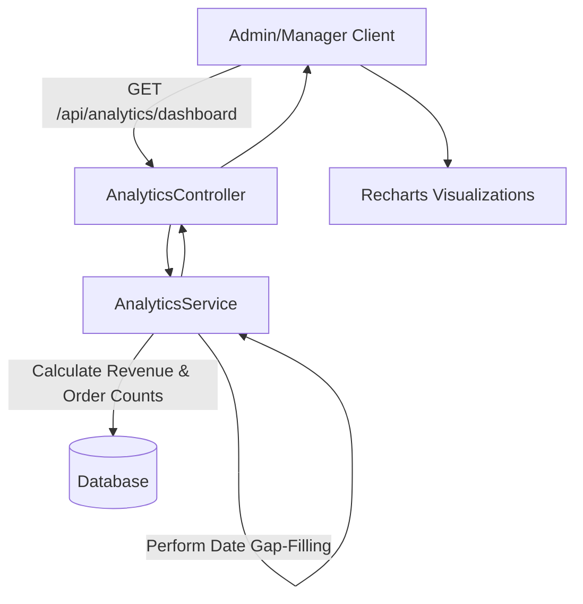

# 📊 Analytics and Dashboard Charts

Welcome to the documentation for the Analytics and Dashboard Charts feature in Lather & Line! 🚀

## 1. 🌟 What the feature does
The Dashboard serves as the central command center for Admins and Managers, providing a high-level overview of the business's performance. It features:
- **KPI Stat Cards:** At-a-glance metrics for Total Revenue, Total Orders, and counts for Pending, In-Progress, Completed, and Cancelled orders, stylized with clear `lucide-react` icons.
- **Revenue Trend (Last 30 Days):** An interactive Recharts Area Chart displaying daily revenue. It fills in gaps (days with no sales) so the trend line is continuous, accurate, and easy to interpret.
- **Status Breakdown:** A Donut/Pie Chart that visualizes the proportion of orders currently in different states (Pending, In-Progress, Completed, Cancelled).
- **Top 5 Services by Revenue:** A Horizontal Bar Chart highlighting the best-performing services, making it simple to identify the most lucrative offerings.
- **Custom Branded Tooltips:** The charts feature custom tooltips that match Lather & Line's overall UI/UX styling.

## 2. 🎯 What problem it solves
Before this feature, there was a lack of clear, immediate visibility into business performance.
- **Trend Visibility:** Managers couldn't easily see if revenue was growing or dropping over a 30-day period.
- **Bottleneck Identification:** By breaking down orders by status visually, staff can immediately notice if an unusually high percentage of orders are stuck in "Pending" or "In-Progress".
- **Strategic Focus:** The "Top 5 Services" chart directly informs marketing and operational efforts by revealing what drives the most revenue.

## 3. 🛠️ How it's implemented
The feature operates via a secure API and visual frontend integration:

### Backend (Spring Boot)
1. Exposes a `GET /api/analytics/dashboard` endpoint protected for `ADMIN` and `MANAGER` roles.
2. The `AnalyticsService` queries the database for orders and aggregates them.
3. **Gap-Filling Logic:** For the 30-day revenue chart, the backend dynamically generates a list of the last 30 days and merges it with the database results, substituting `$0` for days with no revenue.

### Frontend (React & Recharts)
1. Uses TanStack Query/Redux via `analyticsApi.ts` to fetch the data.
2. `AdminDashboardPage.tsx` maps the returned JSON into local state.
3. Components from `recharts` (`AreaChart`, `PieChart`, `BarChart`, `ResponsiveContainer`) are used for visualizations.
4. Custom Tooltip components intercept Recharts' default tooltip to inject Tailwind-styled HTML.

## 4. 🧠 What was learned from building it
- **Time-Series Data Consistency:** Database queries alone often skip days where no events occur (e.g., $0 revenue days). We learned the necessity of implementing a "gap-filling" algorithm in the service layer to ensure the X-axis on our Area Chart doesn't warp time.
- **Recharts Customization:** Default chart tooltips can look very generic. Building custom tooltips taught us how to integrate custom React nodes inside SVG charting libraries, ensuring the branding stays consistent.
- **Performance Considerations:** Calculating Top 5 services and 30-day revenue dynamically on every dashboard load could be heavy; we learned to lean on optimized SQL grouping and aggregation functions rather than performing the math entirely in Java memory.

## 5. 📂 Key files involved
Here are the core files that power this feature:

- **Frontend Dashboard:** [AdminDashboardPage.tsx](file:///c:/games/java%20code/Lether-line/frontend/src/pages/admin/AdminDashboardPage.tsx)
- **Frontend API Definition:** [analyticsApi.ts](file:///c:/games/java%20code/Lether-line/frontend/src/api/analyticsApi.ts)
- **Backend Controller:** [AnalyticsController.java](file:///c:/games/java%20code/Lether-line/backend/src/main/java/com/latherline/controller/AnalyticsController.java)
- **Backend Service (Logic & Gap-filling):** [AnalyticsService.java](file:///c:/games/java%20code/Lether-line/backend/src/main/java/com/latherline/service/AnalyticsService.java)
