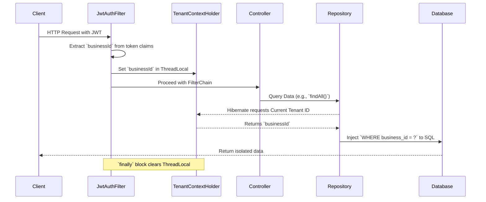

# 🏗️ Application Architecture & Multi-Tenancy

Welcome to the architectural overview of the **Lather & Line** application! This document dives deep into our tech stack and how we successfully handle multiple laundry businesses on a single platform using a robust **Multi-Tenancy Architecture**.

## 🛠️ Tech Stack Overview
- **Frontend**: React 18, TypeScript, Vite, TailwindCSS, React Router v6, TanStack React Query, Recharts, Lucide Icons
- **Backend**: Spring Boot 3.2.4 (Java 21)
- **Database & Migrations**: PostgreSQL, Flyway
- **Real-time & API**: @stomp/stompjs (WebSockets), Axios
- **Infrastructure**: Docker

---

## 🌟 What the Feature Does

Lather & Line is built as a **SaaS (Software as a Service)** platform designed to host multiple laundry businesses simultaneously. 

The multi-tenancy feature ensures that:
- Every business (tenant) on the platform has its own securely isolated workspace.
- Users logging into a specific business only see orders, services, coupons, and subscriptions belonging to *that* business.
- A centralized "store selector" allows administrative or cross-tenant operations when needed.

---

## 🎯 What Problem it Solves

When building a platform for multiple businesses, the primary challenge is balancing **Data Isolation vs. Infrastructure Cost**.

- **Database-per-tenant** is highly secure but incredibly expensive and hard to maintain as you scale to hundreds of businesses.
- **Schema-per-tenant** is slightly better but still requires complex migration strategies (running Flyway hundreds of times).

**Our Solution**: By using a **Shared-Database, Shared-Schema** approach with a discriminator column, we solve the infrastructure cost problem while maintaining strict data isolation. All business data lives in the exact same tables, partitioned securely at the application layer. This makes deployments, database migrations, and scaling completely effortless.

---

## ⚙️ How it's Implemented

We utilize the **Discriminator-Column Multi-Tenancy** design pattern, powered primarily by Hibernate's native `@TenantId` annotation.

### Request Flow
Here is a high-level visualization of how a request securely resolves to a specific tenant:



### Technical Deep Dive

1. **Context Management (`TenantContextHolder`)**:
   We use a ThreadLocal-based holder to store the current tenant ID (`Long`). ThreadLocal ensures that the `businessId` is thread-safe and isolated to the specific HTTP request currently being processed.

2. **Resolving the Tenant (`TenantIdentifierResolver`)**:
   Our configuration implements Hibernate's `CurrentTenantIdentifierResolver<Long>`. Whenever Hibernate executes a query, it calls this resolver. The resolver checks the `TenantContextHolder` and returns the ID. If no tenant is present, it elegantly defaults to business ID `1`.

3. **Entity Configuration (`@TenantId`)**:
   Every tenant-specific entity—such as `User`, `Order`, `ServiceType`, `Address`, `Coupon`, and `SubscriptionPlan`—is annotated with Hibernate's `@TenantId` on a `@Column(name="business_id")`.
   
   ```java
   @Entity
   public class Order {
       @Id
       private Long id;

       @TenantId
       @Column(name = "business_id")
       private Long businessId;
       
       // ... other fields
   }
   ```
   *Magic:* Once annotated, we never have to write `WHERE business_id = ?` in our repository methods. Hibernate automatically injects this into *every* read, update, and delete operation natively!

4. **The Exception (`Business` Entity)**:
   The `Business` entity itself **does not** have the `@TenantId` annotation. This is an intentional architectural choice. By omitting it, queries against the `Business` table remain cross-tenant, which is essential for global operations like the initial store selector where a user decides which business to interact with.

---

## 💡 What Was Learned from Building It

- **The Power of Hibernate 6**: Historically, shared-schema multi-tenancy required custom Hibernate interceptors, aspect-oriented programming, or verbose `@Where` clauses. The introduction of `@TenantId` significantly reduces boilerplate and minimizes the risk of a developer forgetting to filter by business ID.
- **ThreadLocal Hygiene is Critical**: The most vital lesson was ensuring the `finally` block in the `JwtAuthFilter` strictly clears the `TenantContextHolder`. If missed, thread pools in Tomcat could reuse a thread with residual tenant data, leading to severe cross-contamination between requests.
- **SaaS Scalability**: This shared-schema approach requires strong indexing on the `business_id` column across all major tables, as the dataset grows massively.

---

## 📂 Key Files Involved

Check out the following files to explore the code:

### Core Configuration
- [JwtAuthFilter.java](file:///c:/games/java%20code/Lether-line/backend/src/main/java/com/latherline/config/JwtAuthFilter.java) - Extracts the JWT and populates context.
- [TenantContextHolder.java](file:///c:/games/java%20code/Lether-line/backend/src/main/java/com/latherline/config/tenant/TenantContextHolder.java) - ThreadLocal implementation.
- [TenantIdentifierResolver.java](file:///c:/games/java%20code/Lether-line/backend/src/main/java/com/latherline/config/tenant/TenantIdentifierResolver.java) - Bridges ThreadLocal to Hibernate.

### Entities
- [Business.java](file:///c:/games/java%20code/Lether-line/backend/src/main/java/com/latherline/entity/Business.java) - The cross-tenant root entity.
- [Order.java](file:///c:/games/java%20code/Lether-line/backend/src/main/java/com/latherline/entity/Order.java) - Example of a tenant-isolated entity using `@TenantId`.
- [User.java](file:///c:/games/java%20code/Lether-line/backend/src/main/java/com/latherline/entity/User.java)
- [ServiceType.java](file:///c:/games/java%20code/Lether-line/backend/src/main/java/com/latherline/entity/ServiceType.java)
- [Address.java](file:///c:/games/java%20code/Lether-line/backend/src/main/java/com/latherline/entity/Address.java)
- [Coupon.java](file:///c:/games/java%20code/Lether-line/backend/src/main/java/com/latherline/entity/Coupon.java)
- [SubscriptionPlan.java](file:///c:/games/java%20code/Lether-line/backend/src/main/java/com/latherline/entity/SubscriptionPlan.java)
