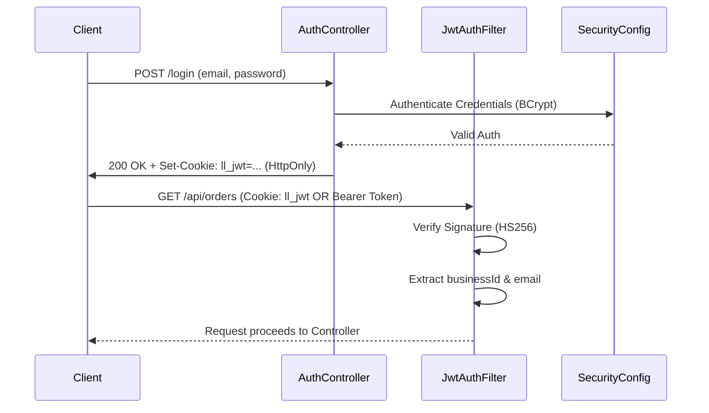

# 🔐 Authentication, Security, and User Roles

Welcome to the documentation for Lather & Line's Authentication and Security layer! This guide will walk you through how we keep user data safe, handle multi-tenancy, and manage permissions across different user roles. 

---

## 🌟 1. What the Feature Does (User-Facing)
Lather & Line provides a seamless and secure identity management system. From the user's perspective, this means:
- **Smooth Logins:** Users can register and log in to the application securely.
- **Persistent Sessions:** After logging in, users stay authenticated securely via HTTP-only cookies without needing to repeatedly enter their credentials.
- **Multiple Roles:** Different users see and do different things. For instance, a `CUSTOMER` can book a laundry service, while a `DRIVER` handles deliveries, and a `MANAGER` views business analytics.
- **Multi-Tenant Friendly:** A single user email can be used across *different* laundry businesses on the Lather & Line platform independently.

## 🛠️ 2. What Problem It Solves
Building a robust SaaS platform requires bulletproof security. Here are the core challenges this implementation solves:
- **Statelessness & Scalability:** We avoid relying on server-side sessions, meaning our application servers can scale effortlessly. We rely entirely on self-contained JSON Web Tokens (JWTs).
- **Security against XSS:** Storing tokens in LocalStorage is risky because they can be stolen by malicious JavaScript (Cross-Site Scripting). We mitigate this by using `HttpOnly` cookies.
- **Client Flexibility:** The dual-token delivery mechanism (Cookie + Bearer Header) ensures that our application works perfectly for web browsers (Cookies) and non-browser clients like mobile apps or API testing tools like Postman (Bearer Headers).
- **Multi-Tenancy Isolation:** By baking the `businessId` directly into the JWT and enforcing a unique `business_id` + `email` constraint, we completely isolate different laundry businesses using our platform.

## ⚙️ 3. How It's Implemented

### Authentication Flow Architecture
Below is a visual representation of how authentication works in Lather & Line:

### Technical Deep Dive
- **JWT-Based Stateless Authentication:** Tokens are signed using HMAC-SHA256 (HS256). Every token carries a `businessId` claim alongside standard claims to identify the user's tenant context.
- **Token Delivery:** 
  - On a successful login or registration, the server issues a `Set-Cookie` header containing the JWT, configured as `HttpOnly`. This cookie configuration is managed via application properties.
  - For API clients and Postman, the system gracefully falls back to checking the `Authorization: Bearer <token>` header.
- **Password Hashing:** Passwords are never stored in plaintext. They are hashed using BCrypt via the standard `DaoAuthenticationProvider`.
- **Method-Level Security:** Security is strictly enforced at the method level using `@EnableMethodSecurity` and `@PreAuthorize` annotations, maintaining clean controller logic.
- **Session Policy:** Configured as `SessionCreationPolicy.STATELESS`. The server never keeps a session in memory.
- **Logout:** A logout call effectively sets the `ll_jwt` cookie's `maxAge` to `0`, instructing the browser to discard it immediately.

### User Data Model & Multi-Tenancy
Users can have one of 5 roles: `CUSTOMER`, `WASHER`, `DRIVER`, `MANAGER`, `ADMIN`.

The database enforces a `UNIQUE(business_id, email)` constraint. This means user `jane@example.com` can register an account with "Business A" (business_id=1) and "Business B" (business_id=2) without conflicts, and her data (addresses, orders) stays strictly isolated.

## 💡 4. What Was Learned From Building It
- **Circular Dependencies in Spring Security:** We ran into an issue where `JwtAuthFilter` needed `UserDetailsService` to load users, but configuring the security beans created a loop. We learned to elegantly solve this using the `@Lazy` injection pattern to break the cycle.
- **Dual Delivery Strategy is Powerful:** Relying solely on cookies makes testing API endpoints in Postman tedious. Supporting both Cookies *and* Bearer headers created an amazing developer experience while keeping the production frontend secure.
- **Stateless Multi-tenancy:** Embedding the `businessId` claim right into the JWT eliminated the need to query the database to know *which* business a request belongs to, saving significant database read overhead.

## 📂 5. Key Files Involved

If you're looking to modify or understand the security layer further, here are the crucial files:

*   [SecurityConfig.java](file:///c:/games/java%20code/Lether-line/backend/src/main/java/com/latherline/config/SecurityConfig.java)
    *   *Role:* Configures stateless sessions, CORS, BCrypt, and registers the filter chain.
*   [JwtAuthFilter.java](file:///c:/games/java%20code/Lether-line/backend/src/main/java/com/latherline/config/JwtAuthFilter.java)
    *   *Role:* Intercepts incoming requests, extracts the JWT (from cookie or header), verifies the HS256 signature, and sets the Spring Security Context.
*   [AuthController.java](file:///c:/games/java%20code/Lether-line/backend/src/main/java/com/latherline/controller/AuthController.java)
    *   *Role:* Handles `/login`, `/register`, and `/logout`. Manages the generation of JWTs and setting the `HttpOnly` cookie.
*   [User.java](file:///c:/games/java%20code/Lether-line/backend/src/main/java/com/latherline/entity/User.java)
    *   *Role:* JPA Entity containing `businessId`, `email`, `role`, and mapping 1:N relations to orders and addresses. Enforces the unique composite constraint.
