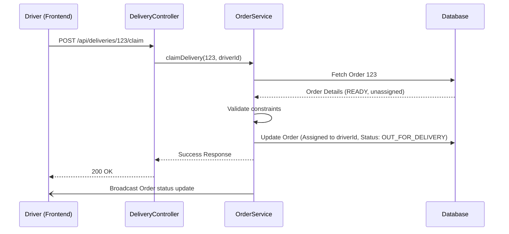

# 🚚 Driver Delivery System

The Driver Delivery System is a core component of Lather & Line that handles the lifecycle of assigning, managing, and tracking deliveries for our laundry service. 

## 🌟 What the feature does (User-Facing)

For **Drivers**, this system provides a dedicated portal to:
* View a list of available (unassigned) orders that are ready for delivery.
* Self-assign (claim) a specific delivery.
* View and manage their own list of claimed deliveries.

For **Admins and Managers**, the system allows:
* Viewing all unassigned orders.
* Manually assigning a delivery to a specific driver if they haven't self-assigned.

## 🛠️ What problem it solves

Before this system, assigning deliveries was a manual and inefficient process. Managers had to individually contact drivers to coordinate who was picking up which load of laundry. 

This feature solves that by creating a **decentralized, gig-worker-style claiming mechanism**. Drivers can proactively pick up work when they are available, reducing administrative overhead and ensuring laundry gets delivered to customers much faster once it's marked as `READY`.

## 💻 How it's implemented

The implementation spans both the frontend React application and the backend Spring Boot REST API.

### 🔌 Backend Endpoints

The system relies on four primary API endpoints in the `DeliveryController`:
* `GET /api/deliveries/mine`: Fetches the currently authenticated driver's assigned deliveries (Restricted to `DRIVER` role).
* `GET /api/deliveries/available`: Fetches all orders with `READY` status that have no driver assigned. (Accessible by `DRIVER`, `ADMIN`, `MANAGER`).
* `POST /api/deliveries/{orderId}/claim`: Allows a driver to self-assign an unassigned order.
* `POST /api/deliveries/{orderId}/assign/{driverId}`: Allows administrators or managers to manually assign a delivery to a specific driver.

### 🧠 Core Logic

The primary business logic resides in `OrderService.java`, particularly the `claimDelivery()` method. When a driver attempts to claim an order:
1. **Validation**: The system checks if the order's status is `READY` and ensures no other driver is currently assigned.
2. **Assignment**: The driver ID is associated with the order.
3. **State Change**: The order status is transitioned from `READY` to `OUT_FOR_DELIVERY`.
4. **Broadcast**: A real-time update is broadcasted via WebSockets/SSE so all active drivers see the order disappear from the "Available" list immediately.

### 🖥️ Frontend Structure

The frontend consists of a dedicated Driver layout and two main views:
* **`DriverLayout`**: A wrapper component providing navigation specific to driver tools.
* **`DriverAvailablePage`**: Polls or listens to real-time updates for `GET /api/deliveries/available`. Allows drivers to click "Claim" on an order.
* **`DriverDeliveriesPage`**: Fetches `GET /api/deliveries/mine` to show the driver their current active routes and tasks.

## 🎓 What was learned from building it

* **Concurrency is tricky**: We learned that race conditions can occur if two drivers click "Claim" at the exact same millisecond. Implementing optimistic locking on the order record ensures only the first driver succeeds.
* **Real-time UX matters**: Broadcasting updates immediately is crucial. If drivers see stale "Available" orders and get an error when claiming, it creates a frustrating experience.
* **Role separation**: Decoupling the Driver UI into its own `DriverLayout` kept the main Admin dashboard cleaner and more focused.

## 📁 Key Files Involved

### Backend
* [DeliveryController.java](file:///c:/games/java%20code/Lether-line/backend/src/main/java/com/latherline/controller/DeliveryController.java)
* [OrderService.java](file:///c:/games/java%20code/Lether-line/backend/src/main/java/com/latherline/service/OrderService.java)

### Frontend
* [DriverLayout.tsx](file:///c:/games/java%20code/Lether-line/frontend/src/components/DriverLayout.tsx)
* [DriverAvailablePage.tsx](file:///c:/games/java%20code/Lether-line/frontend/src/pages/driver/DriverAvailablePage.tsx)
* [DriverDeliveriesPage.tsx](file:///c:/games/java%20code/Lether-line/frontend/src/pages/driver/DriverDeliveriesPage.tsx)
