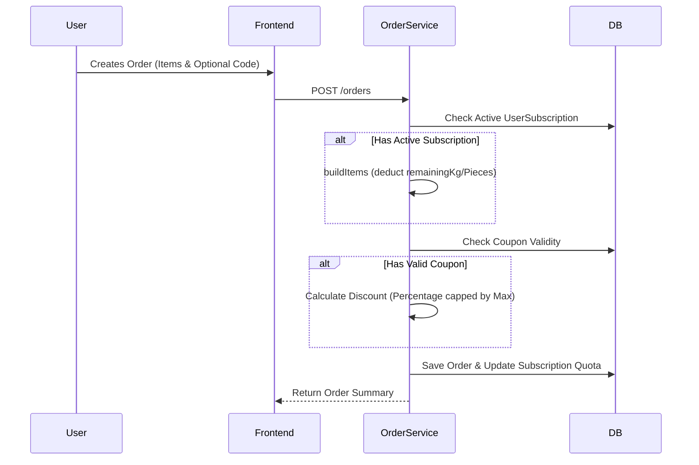

# 🎟️ Coupons and Subscriptions in Lather & Line

> [!NOTE]
> This document provides an overview of the marketing and subscription features in Lather & Line, including coupons for one-off discounts and recurring subscription plans for regular customers.

## 🌟 What the Feature Does

**Coupons:**
Coupons allow administrators to generate unique discount codes that customers can apply during checkout. The discount is calculated as a percentage of the subtotal and is capped at a specific maximum discount value to protect margins. 

**Subscriptions:**
Subscriptions offer customers prepaid laundry packages based on weight (Kg) or item count (Pieces). When a customer purchases a subscription, they are allocated a specific quota. Subsequent orders automatically deduct from this quota instead of charging the customer per-order, creating a seamless "drop and go" experience.

## 🎯 What Problem It Solves

* **Customer Retention:** Subscriptions lock in regular customers, guaranteeing recurring revenue and predictable volume while offering them a simplified, cost-effective service.
* **Marketing & Acquisition:** Coupons incentivize new users to try the service and help re-engage dormant customers.
* **Flexible Billing:** By supporting partial coverage, the system seamlessly handles edge cases. For instance, a user with only 2kg remaining on their subscription who orders 5kg will simply be billed for the remaining 3kg.

## 🛠️ How It's Implemented

### 🏷️ Coupons Implementation
Coupons are represented as entities mapped to the database. They are strictly tenant-scoped to ensure different laundry branches or businesses using the platform have isolated promotions.
* **Fields:** `code`, `discountPercentage`, `maxDiscount`, `validUntil`, `isActive`.
* **Validation:** Before applying a coupon, the system verifies `isActive == true` and that the `validUntil` date hasn't passed.
* **Application:** During the order creation process, the discount is dynamically calculated against the subtotal.
* **Management:** Admins can Create, Read, Update, and Delete these via the `AdminMarketingPage`.

### 🔄 Subscriptions Implementation
Subscriptions are split into two core entities:
1. **SubscriptionPlan:** Represents the product (e.g., "Premium Wash & Fold"). Tracks `name`, `price`, `includedKg`, `includedPieces`, `stripePriceId`, and `isActive`.
2. **UserSubscription:** The active mapping between a user and a plan. Tracks `status`, `currentPeriodEnd`, `remainingKg`, and `remainingPieces`.

**The Deduction Engine (`buildItems`):**
During order creation, the `buildItems` logic intercepts the regular pricing flow:
1. It checks for an active `UserSubscription` that hasn't passed its `currentPeriodEnd`.
2. It compares the items in the order to the `remainingKg` and `remainingPieces`.
3. It deducts the necessary quota from the `UserSubscription`.
4. If the quota covers the entire order, the total is zeroed out for those items. If it only partially covers it, the remaining amount is billed as usual.

### 🏗️ Architecture Flow

## 🧠 What Was Learned From Building It

1. **Partial Coverage Complexity:** Handling partial coverage (e.g., an order exceeding the remaining subscription quota) requires meticulous state management during the `buildItems` phase to ensure accurate invoicing without over-deducting.
2. **Date Boundaries:** Managing subscription auto-expiry via `currentPeriodEnd` requires standardized UTC storage to avoid timezone-related bugs where subscriptions expire too early or too late.
3. **Stripe Integration Alignment:** Mapping local plans to `stripePriceId` taught us the importance of keeping external billing state synchronized with internal quota limits. Webhooks are essential for keeping the `UserSubscription` status up to date.

## 📁 Key Files Involved

* **Coupons**
  * Backend Entity: [Coupon.java](file:///c:/games/java%20code/Lether-line/backend/src/main/java/com/latherline/entity/Coupon.java)
* **Subscriptions**
  * Subscription Plan Entity: [SubscriptionPlan.java](file:///c:/games/java%20code/Lether-line/backend/src/main/java/com/latherline/entity/SubscriptionPlan.java)
  * User Subscription Entity: [UserSubscription.java](file:///c:/games/java%20code/Lether-line/backend/src/main/java/com/latherline/entity/UserSubscription.java)
* **Order Processing (Quota Deduction)**
  * Order Service: [OrderService.java](file:///c:/games/java%20code/Lether-line/backend/src/main/java/com/latherline/service/OrderService.java)
* **Frontend Pages**
  * Marketing/Coupon Admin: [AdminMarketingPage.tsx](file:///c:/games/java%20code/Lether-line/frontend/src/pages/admin/AdminMarketingPage.tsx)
  * Customer Subscriptions: [SubscriptionsPage.tsx](file:///c:/games/java%20code/Lether-line/frontend/src/pages/SubscriptionsPage.tsx)
