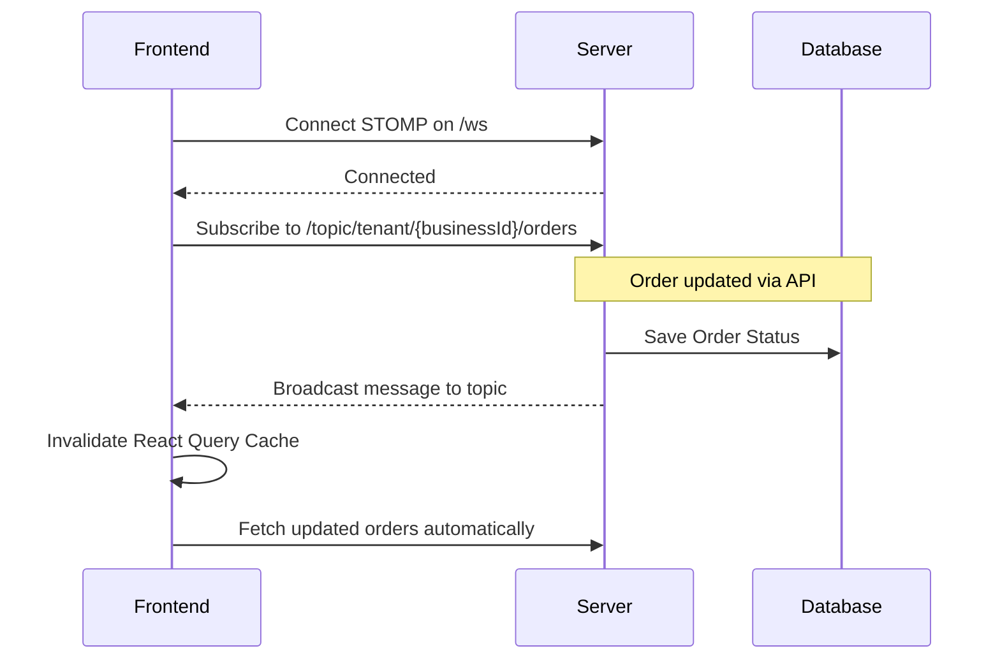

# 🚀 Real-time WebSockets & Automated Notifications

Welcome to the internal documentation for the **Real-time WebSockets and Notifications** systems in Lather & Line! This guide covers how we keep users updated on their laundry orders through live UI refreshes, emails, and SMS messages.

## 🌟 What the feature does
Lather & Line provides customers and staff with up-to-the-minute updates:
- **Real-Time UI Updates:** Whenever an order is created, changes status, or a driver interacts with it, the frontend UI instantly reflects the new state without requiring a manual page refresh.
- **Automated Notifications:** When an order hits critical milestones (like `READY` or `DELIVERED`), the customer automatically receives an email with an HTML receipt and an SMS text. 

## 🎯 What problem it solves
In a laundry and dry cleaning business, operations move fast. 
- **For Staff (Washers & Admins):** They need to see incoming orders and status shifts immediately so they can process laundry without refreshing the dashboard continuously. 
- **For Customers:** Knowing exactly when clothes are ready for pickup or out for delivery builds trust and prevents support calls asking "Is my laundry done?". 
- **Resilience:** Sending emails and SMS texts can be slow or prone to failure (due to external API limits). Our system handles these asynchronously and gracefully degrades to internal logs if external providers are down or unconfigured.

## 🛠️ How it's implemented

### 1. WebSockets (STOMP over WebSocket)
We chose **STOMP (Simple Text Oriented Messaging Protocol)** over raw WebSockets because of its robust publish-subscribe model, which perfectly fits our multi-tenant (business) architecture.

- **Backend Broker:** Configured in Spring Boot using `@EnableWebSocketMessageBroker`. We expose a `/ws` endpoint with a SockJS fallback. 
- **Routing:** Messages are routed via a simple in-memory message broker with the `/topic` prefix. Specifically, we broadcast updates to `/topic/tenant/{businessId}/orders` via `SimpMessagingTemplate`.
- **Frontend Integration:** We use `@stomp/stompjs` on the React frontend. Our custom React component connects to the WebSocket upon authentication. When a STOMP message is received on the tenant's topic, it invalidates the React Query cache (`queryClient.invalidateQueries({ queryKey: ORDER_KEYS.all })`), triggering a seamless background refetch of the latest data.

### 2. Automated Notifications (Composite Pattern)
Our notification architecture is built around a **Composite Pattern** to orchestrate multiple notification channels seamlessly.

- **The Interface:** We define a simple `NotificationService` interface.
- **The Orchestrator:** The `CompositeNotificationService` is annotated with `@Primary` and `@Async`. It takes the order and delegates the heavy lifting to the `EmailNotificationService` and `SmsNotificationService`. 
- **Email Delivery:** Built with Spring's `JavaMailSender`, we construct an HTML template using `MimeMessageHelper` injected with the customer's name, order ID, and price. 
- **SMS Delivery:** Built with the Twilio SDK. 
- **Graceful Degradation:** Each sub-service is wrapped in a `try-catch` block. If `spring.mail.host` is left as `localhost` or Twilio secrets are missing, the application automatically falls back to *mock logging* (e.g. `[MOCK EMAIL] To: user@example.com`). This ensures local development isn't blocked by missing API keys.

## 🧠 What was learned from building it
1. **Cache Invalidation is Powerful:** Instead of sending the full order payload over the WebSocket, sending a lightweight "ping" to invalidate the React Query cache ensures the frontend is always fetching the absolute source of truth. It prevents complex state merging on the client side.
2. **ESM Import Issues with SockJS:** We initially faced module import issues using SockJS in modern Vite/React environments. Opting for native WebSockets (while keeping the SockJS fallback on the backend) was a cleaner frontend solution.
3. **Async Notifications Save the Day:** Putting the `CompositeNotificationService` on a background thread (`@Async`) was crucial. Without it, a slow Twilio API response or email SMTP delay would block the HTTP thread responding to the user's status update request.

## 📂 Key files involved

### Backend
- [WebSocketConfig.java](file:///c:/games/java%20code/Lether-line/backend/src/main/java/com/latherline/config/WebSocketConfig.java) - STOMP & Message Broker configuration.
- [NotificationService.java](file:///c:/games/java%20code/Lether-line/backend/src/main/java/com/latherline/service/notification/NotificationService.java) - Base interface for notifications.
- [CompositeNotificationService.java](file:///c:/games/java%20code/Lether-line/backend/src/main/java/com/latherline/service/notification/CompositeNotificationService.java) - Async orchestrator utilizing the composite pattern.
- [EmailNotificationService.java](file:///c:/games/java%20code/Lether-line/backend/src/main/java/com/latherline/service/notification/EmailNotificationService.java) - Spring Mail integration with HTML templates and mock fallbacks.
- [SmsNotificationService.java](file:///c:/games/java%20code/Lether-line/backend/src/main/java/com/latherline/service/notification/SmsNotificationService.java) - Twilio SMS delivery logic.

### Frontend
- [OrderWebSocket.tsx](file:///c:/games/java%20code/Lether-line/frontend/src/components/OrderWebSocket.tsx) - React component managing the STOMP lifecycle and React Query invalidation.
